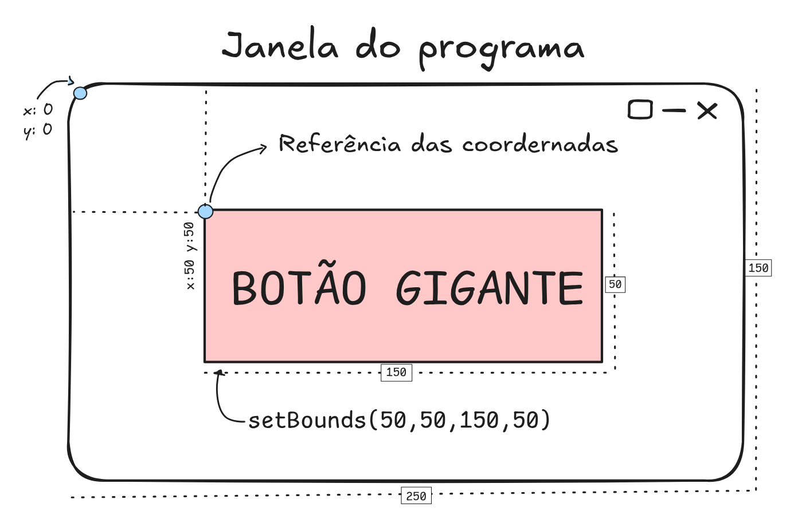


  



## Execício 1
A varríaveis estão em English because look more professional, idk.
```java
import java.awt.Container;
import javax.swing.JButton;
import javax.swing.JComboBox;
import javax.swing.JFormattedTextField;
import javax.swing.JFrame;
import javax.swing.JLabel;
import javax.swing.JTextField;
import javax.swing.text.MaskFormatter;

public class form extends JFrame {

    private JLabel lName;
    private JTextField tName;
    private JLabel lCPF;
    private JFormattedTextField formattedCPF;
    private JLabel lRole;
    private JTextField tRole;
    private JComboBox cmbRole;
    private final String[] usersRole = { "Admin", "User" };
    private JButton btnLogin;
    private Container container;

    public form() {
        setSize(800, 400);
        setTitle("Tela de Login");

        container = getContentPane();
        container.setLayout(null);

        lName = new JLabel("Nome");
        tName = new JTextField();

        lCPF = new JLabel("CPF");
        try {
            formattedCPF = new JFormattedTextField(new MaskFormatter("###.###.###-##"));
        } catch (Exception e) {
            e.printStackTrace();
        }

        lRole = new JLabel("Cargo");
        tRole = new JTextField();
        cmbRole = new JComboBox(usersRole);

        btnLogin = new JButton("Login");

        lName.setBounds(10, 10, 100, 25);
        tName.setBounds(50, 10, 200, 25);
        lCPF.setBounds(10, 50, 100, 25);
        formattedCPF.setBounds(50, 50, 200, 25);
        lRole.setBounds(10, 90, 100, 25);
        cmbRole.setBounds(50, 90, 200, 25);
        btnLogin.setBounds(10, 130, 240, 30);

        container.add(lName);
        container.add(tName);
        container.add(lCPF);
        container.add(formattedCPF);
        container.add(lRole);
        container.add(cmbRole);
        container.add(btnLogin);

        setDefaultCloseOperation(JFrame.EXIT_ON_CLOSE);
        setVisible(true);

    }

    public static void main(String[] args) {
        form login = new form();
    }
}
```

### A sequência lógica de inicialização de uma janela Swing
{}

#### Criação dos Atributos:
Declaração das variáveis dos componentes no escopo da classe para que fiquem acessíveis em outros métodos, caso necessário.

```java
class TelaCadastroPessoa extends JFrame{   
   private JLabel lName;
   private JTextField tName;
   private JLabel lCPF;
   private JFormattedTextField formattedCPF;
}
```

#### Setup do Painel Principal:
Logo no início do construtor, temos que chamar esses dois métodos que vem da classe JFrame, sempra que nossa classe herda as caracterísicas da classe pai.
```java
//retorna o painel interno do JFrame (o Container) onde tudo será desenhado.
// imagine que seria a tag <body> de uma página html.
getContentPane()

//remove o gerenciador automático do Swing, liberando o uso de posições absolutas com setBounds.
setLayout(null)
```
Já adiantando também a config da janela com `setSize` e `setTitle`

#### Instanciação dos Componentes:
Criação dos objetos na memória com seus textos ou configurações iniciais (ex: new JLabel("Nome"), criação do MaskFormatter).

```java
class TelaCadastroPessoa extends JFrame{   
    ...
    public TelaCadastroPessoa(){
     //insira os exemplos   
    }
}
```

#### Posicionamento dos Componetes:


Cálculo das coordenadas (X, Y) e dimensões (largura, altura) de cada elemento na tela.

#### Adição dos Elementos ao Contêiner (add):
```java
lName = new JLabel("Nome");
tName = new JTextField();

lCPF = new JLabel("CPF");
```
O `try catch` no instanciamento do texto formatado evita que a gente insira um inválido pois os caracteres padrão do `MaskFormatter` são:

* `#` - Dígito numérico
* `U` - Letra maiúscula 
* `L` - Letra minúscula
* `?` - Qualquer letra
* `A` - Qualquer letra ou número
* `*` - Qualquer caractere
* `'` - Usado para escapar caracteres especiais 
    - exemplo `MaskFormatter("Cod-'#'-###")` onde o `#`faz parte da máscara.

Digamos que erroneamente eu tivesse criado a másacara com um `N` achando que fosse `N de Número` essa linha dispararia um erro, por isso é de necessário o `try catch`

```java
    formattedCPF = new JFormattedTextField(new MaskFormatter("NNN.NNN.NNN-NN"));
}
```

#### Configuração do Encerramento 
```java
// Define o comportamento ao clicar no botão "X" (fechar a aplicação)
setDefaultCloseOperation(JFrame.EXIT_ON_CLOSE);

// Exibição da janela na tela. 
// Deve ser sempre o último passo para evitar renderizações incompletas dos elementos já adicionados.
setVisible(true);
```

{}

## Execício 2


```java
package exercicios.ex002;

import java.awt.Container;

import javax.swing.JButton;
import javax.swing.JComboBox;
import javax.swing.JFrame;
import javax.swing.JLabel;
import javax.swing.JTextField;

public class StudentForm extends JFrame {
    private JLabel lName;
    private JTextField tName;

    private JLabel lAdress;
    private JTextField tAdress;

    private JLabel lPhone;
    private JTextField tPhone;

    private JLabel lCPF;
    private JTextField tCPF;

    private JLabel lBloodType;
    private JComboBox cmbBloodType;
    private final String[] bloodTypes = { "A", "B", "AB", "O", };
    private JLabel lRhFactor;
    private JComboBox cmbRhFactor;
    private final String[] rhFactors = { "+", "-" };

    private JLabel lCurso;
    private JComboBox cmbCurso;
    private final String[] cursos = { "Ciência da Computação", "Engenharia de Software", "Sistemas de Informação" };

    private JLabel lEmercencyContact;
    private JTextField tEmercencyContact;

    private JLabel lEmercencyPhone;
    private JTextField tEmercencyPhone;

    private JButton btnInsert;
    private JButton btnAbort;

    private Container container;

    public StudentForm() {

        setSize(300, 400);
        setTitle("Tela de Cadastro");

        setVisible(true);
        container = getContentPane();

        container.setLayout(null);

        lName = new JLabel("Nome");
        tName = new JTextField();

        lAdress = new JLabel("Endereço");
        tAdress = new JTextField();

        lPhone = new JLabel("Telefone");
        tPhone = new JTextField();

        lCPF = new JLabel("CPF");
        tCPF = new JTextField();

        lBloodType = new JLabel("Tipo Sanguíneo");
        cmbBloodType = new JComboBox(bloodTypes);

        lRhFactor = new JLabel("Fator Rh");
        cmbRhFactor = new JComboBox(rhFactors);

        lCurso = new JLabel("Curso");
        cmbCurso = new JComboBox(cursos);

        lEmercencyContact = new JLabel("Contato de Emergência");
        tEmercencyContact = new JTextField();
        lEmercencyPhone = new JLabel("Telefone");
        tEmercencyPhone = new JTextField();

        btnInsert = new JButton("Inserir");
        btnAbort = new JButton("Cancelar");

        lName.setBounds(10, 10, 100, 25);
        tName.setBounds(100, 10, 250, 25);
        lAdress.setBounds(10, 50, 100, 25);
        tAdress.setBounds(100, 50, 250, 25);
        lPhone.setBounds(10, 90, 100, 25);
        tPhone.setBounds(100, 90, 250, 25);
        lCPF.setBounds(10, 130, 100, 25);
        tCPF.setBounds(100, 130, 250, 25);
        lBloodType.setBounds(10, 170, 110, 25);
        cmbBloodType.setBounds(110, 170, 50, 25);
        lRhFactor.setBounds(170, 170, 60, 25);
        cmbRhFactor.setBounds(250, 170, 50, 25);
        lCurso.setBounds(10, 210, 100, 25);
        cmbCurso.setBounds(100, 210, 250, 25);
        lEmercencyContact.setBounds(10, 250, 150, 25);
        tEmercencyContact.setBounds(150, 250, 200, 25);
        lEmercencyPhone.setBounds(10, 290, 200, 25);
        tEmercencyPhone.setBounds(100, 290, 250, 25);
        btnInsert.setBounds(10, 370, 160, 35);
        btnAbort.setBounds(190, 370, 160, 35);

        container.add(lName);
        container.add(tName);
        container.add(lAdress);
        container.add(tAdress);
        container.add(lPhone);
        container.add(tPhone);
        container.add(lCPF);
        container.add(tCPF);
        container.add(lBloodType);
        container.add(cmbBloodType);
        container.add(lRhFactor);
        container.add(cmbRhFactor);
        container.add(lCurso);
        container.add(cmbCurso);
        container.add(lEmercencyContact);
        container.add(tEmercencyContact);
        container.add(lEmercencyPhone);
        container.add(tEmercencyPhone);
        container.add(btnInsert);
        container.add(btnAbort);
        setDefaultCloseOperation(JFrame.EXIT_ON_CLOSE);
        setVisible(true);

    }

    public static void main(String[] args) {
        StudentForm StudentFormWindow = new StudentForm();
    }
}
```

## Execício 3
```java
import java.awt.Container;
import java.awt.Component;

import javax.swing.JButton;
import javax.swing.JFormattedTextField;
import javax.swing.JFrame;
import javax.swing.JLabel;
import javax.swing.JTextField;
import javax.swing.text.MaskFormatter;

public class cadFornecedor extends JFrame {
    private JLabel lCompanyName;
    private JTextField tCompanyName;
    private JLabel lCEP;
    private JFormattedTextField formattedCEP;
    private JLabel lCNPJ;
    private JFormattedTextField formattedCNPJ;
    private JLabel lFornecedorCode;
    private JFormattedTextField formattedFornecedorCode;
    private JButton btnConfirmation;
    private Container container;

    public cadFornecedor() {
        container = getContentPane();
        setSize(800, 400);
        setTitle("Cadastro Fornecedor");
        container.setLayout(null);

        try {
            formattedCEP = new JFormattedTextField(new MaskFormatter("#####-###"));
            formattedCNPJ = new JFormattedTextField(new MaskFormatter("##.###.###/####-##"));
            // U -> Uppercase / Maiuscula
            // L -> Lowercase / Minuscula
            formattedFornecedorCode = new JFormattedTextField(new MaskFormatter("UU-#####L"));
        } catch (Exception e) {
            e.printStackTrace();
        }


        lCompanyName = new JLabel("Razão Social:");
        tCompanyName = new JTextField();
        lFornecedorCode = new JLabel("Código do Fornecedor:");
        lCEP = new JLabel("Cógido CEP:");
        lCNPJ = new JLabel("CNPJ:");

        btnConfirmation = new JButton("Cadastrar");


        lCompanyName.setBounds(10, 10, 100, 25);
        addRight(tCompanyName, lCompanyName, 10, 200, 25);
        addBelow(lCEP, lCompanyName, 15, 100, 25);
        addRight(formattedCEP , lCEP, 10, 200,25);
        addBelow(lCNPJ, lCEP, 15, 100, 25);
        addRight(formattedCNPJ, lCNPJ, 10, 200, 25);
        addBelow(lFornecedorCode, lCNPJ, 15, 150, 25);
        addRight(formattedFornecedorCode,lFornecedorCode, 10, 150, 25);
        addBelow(btnConfirmation, lFornecedorCode, 20, 300, 40);
        

        Component[] components = {
            lCompanyName,
            tCompanyName,
            lCEP,
            formattedCEP,
            lCNPJ,
            formattedCNPJ,
            lFornecedorCode,
            formattedFornecedorCode,
            btnConfirmation
        };

        for(Component component : components ){
            container.add(component);
        }

        setDefaultCloseOperation(JFrame.EXIT_ON_CLOSE);
        setVisible(true);

    }

      private void addRight(Component target, Component reference, int gap, int width, int height) {
        int x = reference.getX() + reference.getWidth() + gap;
        int y = reference.getY();
        target.setBounds(x, y, width, height);
    }

    private void addBelow(Component target, Component reference, int gap, int width, int height) {
        int x = reference.getX();
        int y = reference.getY() + reference.getHeight() + gap;
        target.setBounds(x, y, width, height);
    }

    public static void main(String[] args) {
        cadFornecedor telaCadastro = new cadFornecedor();
    }
}
```


<!--
## Execício 1
```java
```
-->
