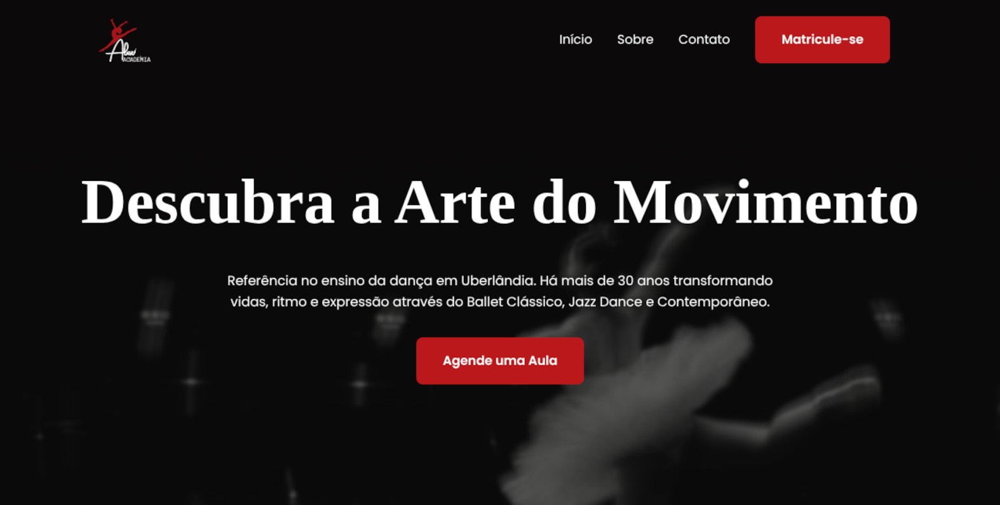

## Engenharia de Software aplicada a um projeto de impacto social

Durante minha graduação em **Sistemas de Informação na Faculdade Anhanguera**, participei do **Projeto de Extensão II**, desenvolvido no contexto do Programa de Ação e Difusão Cultural. O objetivo da atividade era aplicar conhecimentos de Tecnologia da Informação na resolução de necessidades reais relacionadas a atividades culturais.

Nesse contexto, desenvolvemos uma solução digital para a **Alex Academia de Dança, em Uberlândia-MG**, com foco em melhorar sua presença na internet, facilitar o acesso às informações sobre aulas e eventos e criar um canal de contato mais direto com potenciais alunos.

O projeto foi particularmente relevante para minha formação porque permitiu aplicar conceitos que normalmente são estudados de forma isolada durante a graduação em um único cenário real: **engenharia de requisitos, modelagem e organização de sistemas, desenvolvimento web, UX, gerenciamento de projeto, controle de versão e tomada de decisões técnicas**.

## Levantamento de requisitos

Antes de iniciar a implementação, realizamos uma entrevista com os responsáveis pela academia para entender o negócio, identificar as principais necessidades e definir quais informações deveriam estar disponíveis para os visitantes.

A partir desse levantamento, foram definidas as principais áreas da aplicação:

* Início;
* Aulas;
* Eventos;
* Contato.

Também foram coletados os materiais necessários para a construção da interface, incluindo logotipo, fotografias e textos institucionais. Com os requisitos iniciais definidos, trabalhamos na identidade visual e na elaboração de protótipos para **desktop e dispositivos móveis**.

Essa etapa foi importante para evitar que o desenvolvimento começasse diretamente pelo código. A solução foi pensada a partir do problema e das necessidades do usuário, e não apenas a partir das tecnologias disponíveis.

## Decisões de arquitetura e experiência do usuário

Uma das principais decisões tomadas durante o desenvolvimento foi simplificar a arquitetura de navegação.

Inicialmente, poderia ser adotada uma estrutura tradicional com diversas páginas independentes. Entretanto, percebemos que grande parte das informações poderia ser apresentada de maneira mais eficiente em uma única página. Por isso, concentramos as principais seções na página inicial e utilizamos a navegação por **scroll**, reduzindo a quantidade de interações necessárias para encontrar uma informação.

A página de contato permaneceu separada por possuir uma função específica: reunir os canais de comunicação da academia e apresentar sua localização por meio de um **mapa interativo do Google Maps**.

Essa decisão exemplifica um dos principais aprendizados do projeto: uma arquitetura tecnicamente mais complexa não necessariamente representa uma solução melhor. A arquitetura deve estar relacionada ao comportamento esperado do usuário e aos requisitos reais do sistema.

## Implementação técnica

A aplicação foi desenvolvida com HTML5, CSS3 e JavaScript Vanilla, priorizando uma arquitetura simples, responsiva e sem dependências desnecessárias. A interface utiliza abordagem Mobile First, enquanto o JavaScript é responsável pelas interações do menu, galeria dinâmica e validação do formulário. 

Sim, seria possível desenvolver uma solução tradicional envolvendo servidor, banco de dados e uma API para processamento das mensagens. Entretanto, após analisar o contexto da academia, identificamos que o **WhatsApp já era um dos principais canais utilizados para comunicação e negócios**.

Por isso, optamos por uma arquitetura mais simples:

**Formulário → Validação em JavaScript → Mensagem pré-formatada → WhatsApp da academia**

Dessa maneira, o sistema consegue cumprir seu objetivo principal sem a necessidade de manter uma infraestrutura de backend para armazenar e processar mensagens.

Essa decisão reduziu a complexidade operacional do projeto e, ao mesmo tempo, manteve o fluxo de contato alinhado ao comportamento real do público da instituição. O relatório do projeto registra essa mudança de estratégia e a decisão de não implementar banco de dados ou backend para essa funcionalidade.

Mais do que simplesmente evitar uma tecnologia, essa decisão representou um exercício de **engenharia de software orientada a requisitos**: utilizar somente a complexidade necessária para resolver o problema.

## Controle de versão e organização do projeto

O projeto também envolveu a utilização de **Git e GitHub** para controle de versão e organização do código.

Como responsável pela organização inicial, participei da criação do repositório e da definição de um **roadmap de tarefas**, estruturando o desenvolvimento de forma incremental. Também foi definida a **licença MIT** para o código e foram consideradas questões relacionadas aos direitos autorais das imagens e demais mídias fornecidas pela instituição parceira.

Essa etapa trouxe um aprendizado importante sobre o fato de que desenvolvimento de software não se limita à implementação das funcionalidades. Versionamento, organização do trabalho, documentação, licenciamento e gestão dos artefatos também fazem parte do ciclo de desenvolvimento.

## Resultado

O resultado foi um **website institucional responsivo**, desenvolvido para apresentar a academia, divulgar suas aulas e eventos e facilitar o contato com novos alunos.

A solução também incorporou recursos voltados à conversão, principalmente a integração do fluxo de contato com o WhatsApp e a disponibilização de um mapa interativo para localização da academia.

O feedback da instituição reforçou esse resultado. Segundo a academia, o novo website contribuiu para profissionalizar sua presença digital, aumentar sua visibilidade e criar um canal que pode auxiliar na atração de novos alunos e divulgação de eventos.

## Impacto social e ODS

Por se tratar de um projeto de extensão vinculado ao programa de Ação e Difusão Cultural, o desenvolvimento também foi relacionado aos **Objetivos de Desenvolvimento Sustentável da ONU**.

As metas selecionadas para o projeto foram:

* **ODS 8 — Trabalho Decente e Crescimento Econômico**;
* **ODS 9 — Indústria, Inovação e Infraestrutura**, especificamente a Meta 9.c;
* **ODS 11 — Cidades e Comunidades Sustentáveis**, especificamente a Meta 11.4.

Nesse contexto, o projeto demonstra como uma solução relativamente simples pode contribuir para a profissionalização de uma iniciativa cultural local e ampliar sua capacidade de divulgação e comunicação.

## Principais aprendizados técnicos

O maior aprendizado desse projeto foi perceber que **engenharia de software não significa adicionar complexidade, mas tomar decisões técnicas coerentes com o problema que precisa ser resolvido**.

Na prática, o projeto permitiu consolidar conhecimentos em:

* levantamento e análise de requisitos;
* prototipação de interfaces;
* desenvolvimento com HTML5 semântico;
* CSS3 e design responsivo;
* abordagem Mobile First;
* JavaScript Vanilla e manipulação de comportamentos da interface;
* validação de formulários;
* integração de aplicações web com canais externos de comunicação;
* arquitetura de aplicações sem backend;
* controle de versão com Git e GitHub;
* organização de tarefas e roadmap;
* licenciamento de software;
* consideração de direitos autorais sobre mídias;
* UX e redução de fricção na jornada do usuário;
* tomada de decisões técnicas baseada em requisitos reais.

A experiência também reforçou uma perspectiva que considero fundamental na minha formação como desenvolvedor: **a melhor solução não é necessariamente a mais sofisticada, mas aquela que resolve o problema de maneira adequada, sustentável e compreensível**.

Nesse projeto, o uso de HTML, CSS e JavaScript sem frameworks foi suficiente para construir a solução necessária. A ausência de backend não foi uma limitação técnica, mas uma decisão arquitetural baseada no contexto. E a escolha de uma navegação predominantemente por scroll não foi apenas estética, mas uma tentativa de reduzir a fricção para o usuário.

Foi justamente essa combinação entre **requisitos, experiência do usuário e decisões de engenharia** que tornou o projeto uma experiência importante para minha formação em Sistemas de Informação.

## Projeto


  
  

