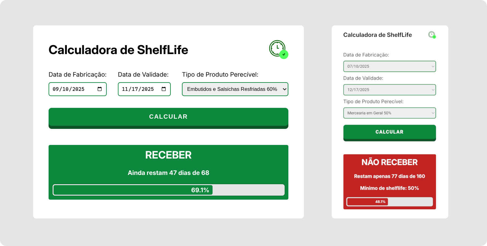
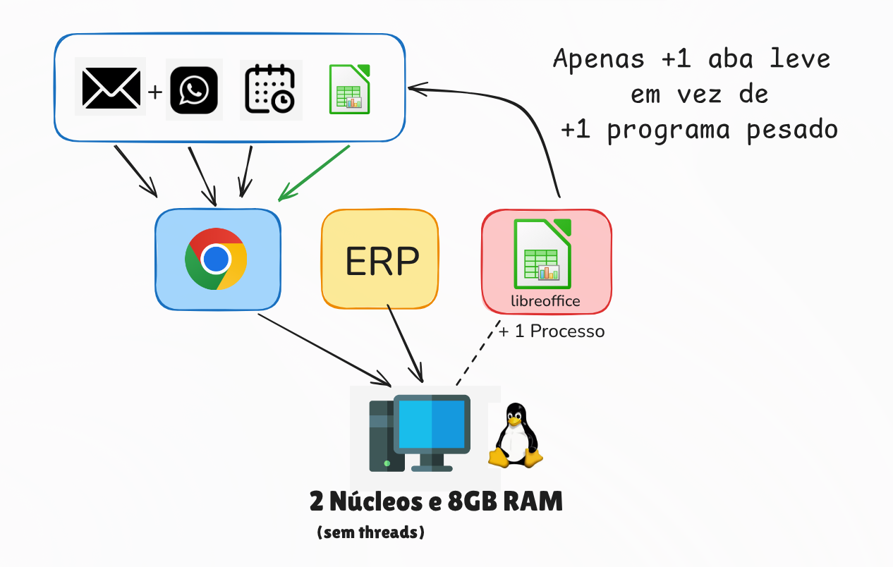



Trabalhei como conferente em uma rede de supermercados, sendo responsável por auditar todas as mercadorias que entravam e saíam da unidade. Meu fluxo de trabalho diário era direto:

- Conferir a lista de fornecedores agendados para o dia;
- Checar e-mails e grupos de WhatsApp para eventuais urgências;
- Encaminhar as NFs dos fornecedores na doca para o financeiro dar baixa no ERP.

O financeiro era responsável por checar se a Nota Fiscal emitida estava de acordo com os custos e quantidades do pedido. Cabia a mim a função de auditar a mercadoria na docaantes de ser levada pro estoque, eu tinha que abrir e verificar todas as caixas de cada entrega:
- Se o item entregue era exatamente o mesmo descrito na NF;
- Se a quantidade física conferia;
- Se a qualidade cumpria os diversos requisitos sanitários e comerciais.

A temperatura para produtos refrigerados era fácil de memorizar, e avarias nas embalagens eram simples de identificar de longe. Porém, o **Shelf Life** (prazo de validade aceitável no momento do recebimento) possuía diversas categorias e regras específicas. Para isso, utilizávamos uma planilha.

Diversas vezes ao dia eu precisava recorrer a esse recurso. Além de garantir a exatidão da conferência, ter os dados em mãos era fundamental no momento de argumentar e recusar uma mercadoria com o entregador, que já tinha gasto tempo e esforço descarregando e organizando a carga, e com certeza iria contra-argumentar.

### O gargalo da planilha no hardware limitado

Meu problema com essa planilha era puramente operacional: eu precisava abrir a suíte pesada do **LibreOffice Calc** em uma máquina modesta, com apenas um **processador Dual-Core e 8GB de RAM**, unicamente para calcular uma diferença simples de dias restantes.

Durante o dia, eu já mantinha uma instância do Google Chrome aberta com o e-mail, WhatsApp Web (para comunicação interna com outros departamentos) e o sistema de agendamento, no qual eu atualizava o status e as ocorrências dos fornecedores.

Minha primeira ideia foi migrar o arquivo para o [Google Sheets](https://pt.wikipedia.org/wiki/Google_Planilhas). Dessa forma, a planilha ficaria fácil de acessar e a versão atualizada seria compartilhada instantaneamente com os colegas das outras unidades. Entretanto, ter que manter minha conta pessoal do Google logada na máquina da empresa não parecia a melhor forma de fazer.

No momento eu lembrei de uma frase específica:

> *"Esse sistema poderia ser uma planilha."*

Frase essa que já ouvi diversas vezes no [NerdTech](https://jovemnerd.com.br/podcasts/nerdtech), episódios de podcast colaborativos entre Jovem Nerd e a Alura.

Mas, nesse caso, fiz o caminho inverso: **saí da planilha para criar uma página web simples, leve e modesta.**

---

### Análise de Recursos: Por que trocar o software por uma Web Page?

Em uma máquina com processador Dual-Core, qualquer aplicação desktop completa causa picos de uso no processador durante a inicialização e disputa a pouca memória disponível. 

A diferença de consumo entre as duas abordagens é brutal:

| Métrica | LibreOffice Calc (Desktop) | Minha Calc (Aba no Chrome) |
| :--- | :--- | :--- |
| **Pico de Processador (CPU)** | **60% a 100%** de uso de 1 núcleo no startup | **~0% a 2%** de uso (Script local leve) |
| **Consumo de Memória (RAM)** | **~150MB a 300MB** dedicados ao processo | **~15MB a 30MB** na instância do navegador |
| **Tempo de Resposta** | Segundos de carregamento ao abrir o app | Instantâneo ao alternar de aba |

Como eu já mantinha o Chrome aberto obrigatoriamente para checar e-mails e WhatsApp Web, criar o site significou **adicionar apenas mais uma aba leve em vez de manter mais um processo pesado rodando em segundo plano**.

---

### Estrutura do Projeto

Para manter a solução o mais leve e acessível possível, o projeto foi desenvolvido com uma arquitetura **Vanilla Web** (sem *frameworks* pesados ou etapas de *build*):

- `index.html`: A interface simples e responsiva, otimizada tanto para monitores de escritório quanto para telas de celular.
- `style.css`: Estilização limpa e legível para ambientes com muita luz (como as docas de recebimento).
- `script.js`: Toda a lógica de cálculo de *Shelf Life* executada no próprio navegador (*Client-Side*), com resposta instantânea.

---

### O Real Aprendizado: Visão de Negócio e Análise de Processos

Mais do que escrever linhas de código em JavaScript, o principal aprendizado deste projeto esteve na **análise de processos e na visão do negócio**:

* **Eliminação de Gargalo:** Identificar que o problema não era a limitação do computador em si, mas o uso de uma ferramenta desproporcional para uma tarefa simples.
* **Padronização e Garantia de Qualidade:** Ao publicar a calculadora na web, qualquer conferente das outras unidades da rede passou a ter acesso à ferramenta pelo celular ou pelo computador. Isso garantiu que **100% da equipe seguisse exatamente os mesmos requisitos de conferência**, sem o risco de alguém utilizar uma cópia antiga ou modificada da planilha.

Não se trata de uma arquitetura mirabolante de código, nem era oficialmente minha atribuição na época — eu poderia simplesmente ter aberto um chamado na TI pedindo um upgrade de máquina. Contudo, olhar para o processo, entender a dor da operação e criar uma solução leve resolveu o problema na raiz e padronizou o recebimento de mercadorias em toda a rede.


  
  

