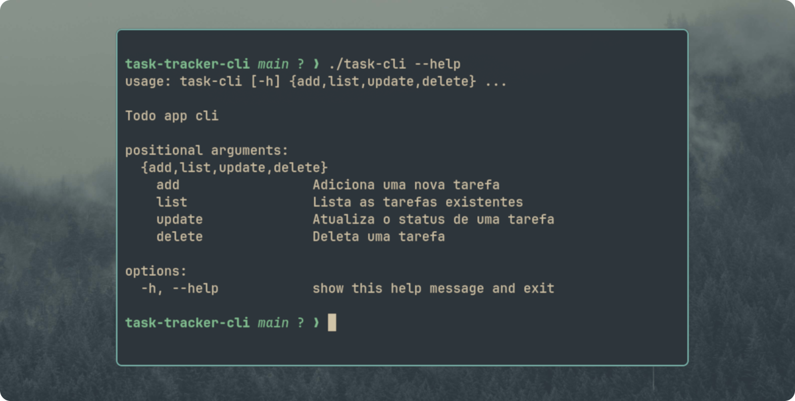

---
date:
title: Task Tracker CLI
description:
author: William Almeida
location: Uberlândia - MG
tags:
  - JavaScript
  - Projeto
  - Web
categories:
  - Carreira
  - Desenvolvimento
sidebar:
  hide: true
---



Este é um projeto simples que desenvolvi ao iniciar minha jornada pelo [roadmap.sh](https://roadmap.sh), um guia de estudos focado em *back-end*. 

No ecossistema *back-end*, é totalmente possível fugir do terminal e realizar a maioria das configurações de ambiente via interface gráfica (GUI). No entanto, o ganho de produtividade ao resolver tudo direto na linha de comando é incomparável. Basta abrir o terminal e executar:

```bash
# Define a versão do Python globalmente no sistema
mise use -g python@3.14

# Define uma versão específica apenas para o diretório atual
mise use python@3.8
```
Além da agilidade, a linha de comando me dá uma clareza muito maior sobre o que está acontecendo por trás dos panos. Uso Linux como sistema operacional principal desde 2019 (I use Arch btw) e me lembro bem do início: eu ficava me perguntando como o comando sudo apt update && sudo apt upgrade -y realmente funcionava. Como o terminal interpretava aquilo? Onde estava a função que consultava os servidores? Como ele identificava, baixava e instalava as atualizações substituindo as versões anteriores?

O roadmap.sh sugere o Task Tracker como primeiro projeto por uma razão estratégica: ele elimina a camada visual (front-end) e nos força a focar estritamente na lógica de aplicação e na manipulação de dados. É o exercício perfeito para compreender a anatomia de uma aplicação sem distrações.



Escolhas Técnicas: Python e a Filosofia Linux
Para este projeto, fiz escolhas alinhadas com meu ambiente diário e com meus objetivos de carreira:

- Linguagem Python: Escolhi o Python por ter sido a primeira linguagem com a qual tive contato — na época do curso técnico em informática no IFPI e acompanhando as aulas do Professor Guanabara. Além disso, o Python é uma ferramenta indispensável para scripting e automação no ecossistema Linux.

- Foco em CLI (Interface de Linha de Comando): Como entusiasta do ecossistema Linux e usuário assíduo do Bash, criar um utilitário de terminal foi um passo natural. Eu queria entender a lógica por trás das ferramentas que utilizo no meu dia a dia (como o gerenciamento de dotfiles).

- Persistência de Dados Locais: O projeto permitiu exercitar a manipulação de arquivos no disco e a persistência de dados localmente, garantindo que as tarefas salvas não fossem perdidas ao encerrar a sessão do terminal.



