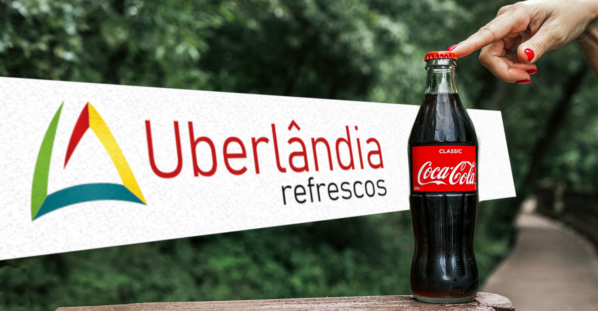


  

  Atuando desde novembro de 2025


Uberlândia Refrescos (Coca-Cola) · Tempo integral · Uberlândia, MG

Sou responsável pela estratégia no ponto de venda, garantindo disponibilidade e visibilidade de todo o portfólio Coca-Cola em loja.

Trabalho ativamente na **exposição de marca** — implementando pontos extras, ilhas e terminais promocionais pra maximizar o giro de estoque e aumentar o share de mercado — e faço **monitoramento constante** de indicadores como precificação, presença da marca e ações da concorrência.

Também atuo diretamente na **gestão de qualidade**, com controle rigoroso de estoque e validade através da metodologia PEPS (Primeiro que Entra, Primeiro que Sai), incluindo o controle de Shelf Life direto no ponto de venda.

## Ferramentas do dia a dia


  
  
